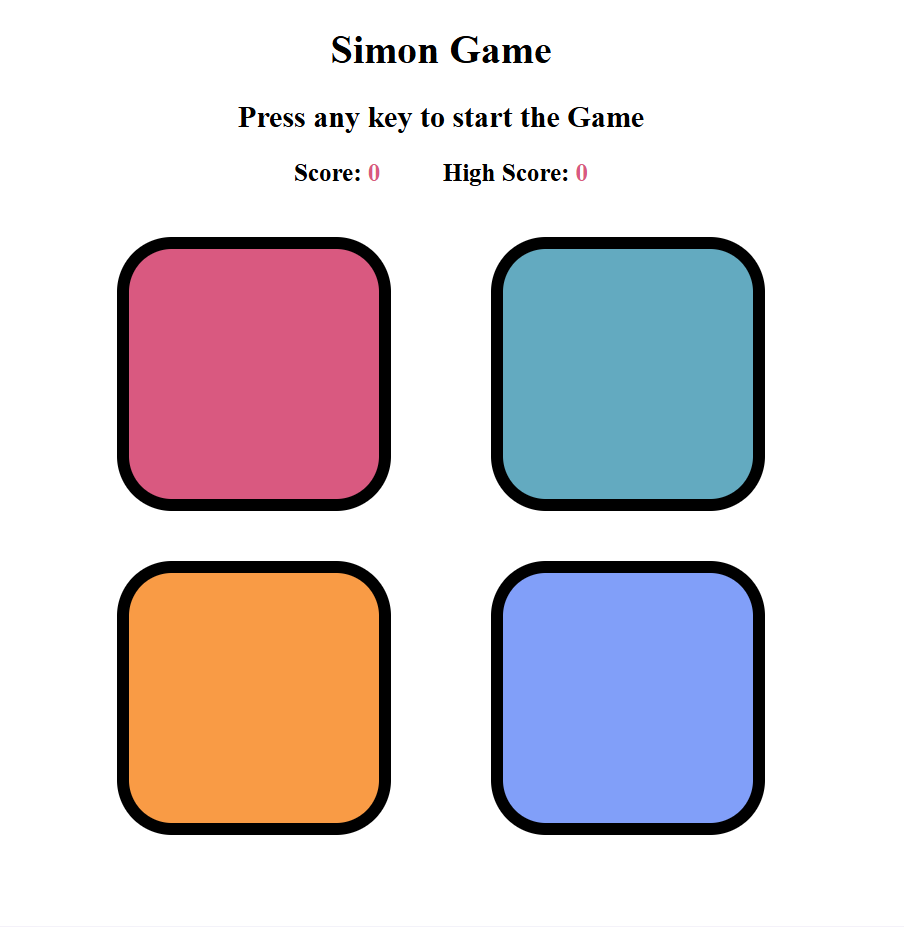
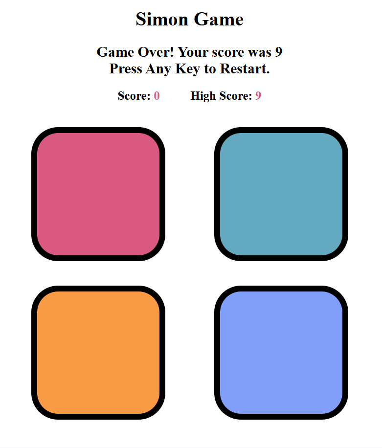

# 🎮 Simon Says Game

🔥 **CHALLENGE TIME!**  
Think your memory is sharp enough?  
👉 **Try to beat my highest score** without making a single mistake!  
If you succeed, ⭐ star the repo and share your score 😄

---

A classic and interactive **Simon Says memory game** built using **HTML, CSS, and Vanilla JavaScript**.  
The game tests your memory by generating an increasing color sequence that the player must repeat accurately to advance.

---

## Features 🚀

### 🧠 Gameplay & Logic
- Classic **Simon Says** color sequence game
- Random color sequence generation at each level
- User must repeat the exact sequence to progress
- Game ends immediately on wrong input
- Progressive difficulty with increasing levels

### ✅❌ Visual Feedback (Correct & Wrong Moves)
- **Green flash** indicates a **correct button press**
- **Red screen flash** indicates a **wrong sequence**
- Instant visual feedback helps players understand mistakes clearly
- Enhances user experience and gameplay clarity

### 📊 Score Tracking
- Displays **current score** (level reached)
- Tracks and updates **high score**
- High score updates dynamically during gameplay

### 🎨 User Interface & Experience
- Colorful and interactive game buttons
- Game sequence flash animation
- User input flash animation
- Game-over message with restart instruction
- Clean, centered, and minimal UI design

---

## Screenshots 🖼️

### Starting Page


### Game Over Screen


---

## Tech Stack 🛠️

### Frontend:
- **HTML5** – Game structure and layout
- **CSS3** – Styling, animations, and color feedback
- **JavaScript (Vanilla)** – Game logic, sequence handling, and state management

---

## Installation & Setup 🛠️

```bash
# Clone the repository
git clone https://github.com/Shggod/Simon-Says-Game.git

# Navigate to the project directory
cd Simon-Says-Game

# Open index.html in your browser
```

No additional libraries or setup required.

---

## Features in Detail 📱

### 🧠 Game Logic
- Generates random color sequence using JavaScript
- Stores game sequence and user input sequence
- Compares user input step-by-step with the game sequence
- Ends the game immediately on incorrect input

### 🔄 Game State Management
- Tracks game start and reset states
- Resets level, score, and sequences on game over
- Allows restart with a single key press

### 🎨 UI & Visual Feedback
- **Green highlight** confirms correct user input
- **Red background flash** signals incorrect sequence
- Flash animations improve reaction-based learning
- Large, clickable buttons for better interaction

### ⚙️ Client-Side Logic
- Pure JavaScript without any frameworks
- Efficient event handling for keyboard and mouse
- Lightweight and fast execution

---

## Contributing 🤝
Want to improve the game or add new features?  
Fork the repository and submit a pull request.

---

## 🧑‍💻 Contributors
- Shivam Gupta – [GitHub](https://github.com/shggod)

---

🚀 Built with ❤️ by **Shivam Gupta**
